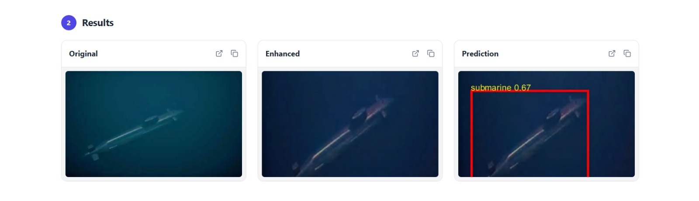

# OceanSight

## Overview
OceanSight is an AI-assisted platform for real-time underwater image enhancement and threat detection. It couples a TensorFlow-based enhancement model with a YOLOv8 detector, then exposes the pipeline through a FastAPI backend and a React/Vite frontend secured with Firebase Authentication and Realtime Database logging.



## Key Features
- **Hybrid AI pipeline**: TensorFlow autoencoder-style enhancer followed by Ultralytics YOLOv8 object detection.
- **FastAPI service**: Single `/predict` endpoint that accepts underwater imagery, persists artifacts, and returns the annotated detection output.
- **React dashboard**: Authenticated upload workflow, live processing feedback, result previews, and a per-user history view backed by Firebase Realtime Database.
- **Audit trail**: Upload/enhance/prediction metadata persisted per user for traceability.

## System Architecture
1. **Frontend (Vite + React 18)** renders the dashboard, handles authentication, and calls the backend.
2. **Firebase services** manage auth state (`getAuth`) and store prediction history (`Realtime Database`).
3. **ML Backend (FastAPI)** enhances and detects objects, saving outputs to local folders and responding with the annotated image.
4. **Model artifacts** (`model2.h5`, `best.pt`) are loaded at startup; directories `uploads/`, `enhanced/`, and `results/` hold intermediate files.

## Repository Layout
```
OceanSight/
├── Frontend/            # Vite + React client (authentication, upload UI, history)
├── MLbackend/           # FastAPI service loading TensorFlow enhancer + YOLO detector
├── uploads/             # Created at runtime for raw uploads
├── enhanced/            # Created at runtime for enhanced images
├── results/             # Created at runtime for annotated outputs
├── README.md            # Project overview (this file)
├── readme               # Legacy setup snippet (kept for reference)
└── ...
```

## Prerequisites
- **Python**: 3.10.x recommended (TensorFlow compatibility).
- **Node.js**: 18.x or newer (Vite requirement).
- **npm**: 9.x or newer.
- **CUDA/cuDNN** (optional): Required only if running GPU-accelerated inference.

## Backend (FastAPI + TensorFlow + YOLO)
### 1. Create and activate a virtual environment
1. `cd MLbackend`
2. `python -m venv .venv`
3. `.venv\Scripts\activate` (Windows) or `source .venv/bin/activate` (macOS/Linux)

### 2. Install dependencies
1. `pip install --upgrade pip`
2. `pip install -r requirements.txt`

### 3. Verify model assets
- **model2.h5**: TensorFlow enhancement model.
- **best.pt**: Ultralytics YOLOv8 checkpoint.
- Place both in `MLbackend/` (same directory as `main.py`).

### 4. Run the API server
1. `uvicorn main:app --reload`
2. The service listens on `http://127.0.0.1:8000` by default.

### API Reference
- **GET `/`** → `{ "message": "API is running! Upload an image to /predict" }`
- **POST `/predict`**
  - **Request**: `multipart/form-data` with field `file` (image bytes).
  - **Processing**:
    1. Saves the original file in `uploads/`.
    2. Enhances the image via TensorFlow model and writes to `enhanced/`.
    3. Runs YOLO detection, draws bounding boxes, and writes to `results/`.
  - **Response**: Annotated image returned as a binary file (`FileResponse`).

### Example cURL
```bash
curl -X POST \
  -F "file=@sample.jpg" \
  http://127.0.0.1:8000/predict \
  --output result.jpg
```

### Runtime Folders
- **uploads/**: raw user input.
- **enhanced/**: enhanced output from TensorFlow model.
- **results/**: annotated detection results returned to clients.
- All folders are auto-created via `os.makedirs(..., exist_ok=True)` on service start.

## Frontend (React + Vite + Firebase)
### 1. Install dependencies
1. `cd Frontend`
2. `npm install`

### 2. Configure environment variables (`Frontend/.env`)
```
VITE_URL=http://127.0.0.1:8000        # FastAPI base URL (no trailing slash)
VITE_FIREBASE_API_KEY=...
VITE_FIREBASE_AUTH_DOMAIN=...
VITE_FIREBASE_PROJECT_ID=...
VITE_FIREBASE_STORAGE_BUCKET=...
VITE_FIREBASE_MESSAGING_SENDER_ID=...
VITE_FIREBASE_APP_ID=...
VITE_FIREBASE_MEASUREMENT_ID=...
```

### 3. Development server
1. `npm run dev`
2. Access the UI at the Vite dev URL (typically `http://127.0.0.1:5173`).

### 4. Production build
1. `npm run build`
2. Preview locally with `npm run preview`.

### Firebase Data Model
- Users are stored at `users/{uid}` with metadata (`email`, `displayName`, timestamps).
- Predictions append under `users/{uid}/predictions/{pushId}` with URLs and timestamps.

## End-to-End Workflow
1. User authenticates via Firebase (email/password or Google OAuth).
2. Dashboard issues POST `/predict` with an image and Firebase ID token (token currently unused by backend).
3. Backend enhances, detects, persists intermediate files, and returns the annotated image.
4. Frontend expects JSON containing `original_url`, `enhanced_url`, `result_url` and records the response URLs in Firebase history.
5. History view retrieves the prediction list from Firebase and renders cards with copyable links.

> **Note**: The current backend returns a binary image, while the frontend expects JSON URLs. Aligning these contracts (either by adjusting the backend to upload artifacts and respond with URLs, or adapting the frontend to handle binary data) is required for full integration.

## Testing & Quality Checks
- **Frontend**: `npm run lint`
- **Backend**: No automated test suite yet; manual verification via cURL or API client.


## Roadmap Ideas
- Align backend response schema with frontend expectations (JSON URLs).
- Persist enhanced/detected images to object storage (Firebase Storage/S3) and store signed URLs in Firebase.
- Add automated tests (unit + integration) for both backend and frontend.
- Containerize services for simplified deployment.

 
